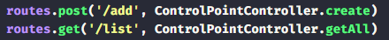
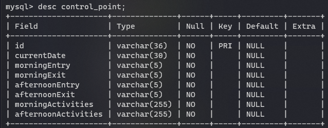

## Controle de Ponto API

Controle de horas para saber o tempo de turnos e tempo total.

### Iniciar projeto

```bash
yarn // instalar as dependências
yarn dev // Iniciar
```

Opções de criar e listar



Configurar o arquivo `ormconfig.json` com uma conexão `MySql`

#### Tabela


